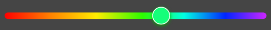
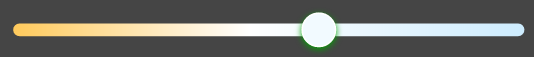

# 颜色滑动条组件

## 导入
```javascript
import ColorSlider from '../../components/ColorSlider';

const { ColorTempSlider, ColoursSlider } = ColorSlider;
```

## 1. ColoursSlider 彩色滑动条 

### Props
```javascript
    containerStyle: ViewPropTypes.style, // 容器样式
    trackStyle: ViewPropTypes.style, // 轨道样式
    thumbStyle: ViewPropTypes.style, // 滑块样式
    onChange: PropTypes.func, // 颜色改变 onChange({r, g, b})
    onComplete: PropTypes.func, // 颜色改变结束事件 onComplete({r, g, b})
    hsl: PropTypes.object, // 当前颜色 { h: 0, s: 100, l: 50 },
```

### Use
```javascript
  state = {
    hsl: {
      h: 0,
      s: 100,
      l: 50,
    },
  };
  // ...
  <ColoursSlider
    hsl={this.state.hsl}
    onChange={hsl => {
      console.log(hsl)
    }}
    onComplete={hsl => {
      this.setState({
        hsl: { ...hsl },
      });
    }}
    containerStyle={styles.containerStyle}
    trackStyle={styles.trackStyle}
    thumbStyle={styles.thumbStyle}
  />
  // ...
  const styles = StyleSheet.create({
    containerStyle: {
      backgroundColor: '#000',
      width: 350,
      height: 40,
    },
    trackStyle: {
      width: 200,
      height: 10,
    },
    thumbStyle: {
      width: 30, 
      height: 30, 
      borderWidth: 2
    }
  });
```

## 2. ColorTempSlider 色温滑动条 

### Props
```javascript
    containerStyle: ViewPropTypes.style, // 容器样式
    trackStyle: ViewPropTypes.style, // 轨道样式
    thumbStyle: ViewPropTypes.style, // 滑块样式
    onChange: PropTypes.func, // 颜色改变 onChange({r, g, b})
    onComplete: PropTypes.func, // 颜色改变结束事件 onComplete({r, g, b})
    value: PropTypes.number, // 当前色温
    min: PropTypes.number, // 色温最小值
    max: PropTypes.number, // 色温最大值
```

### Use
```javascript
  state = {
    colorTemp: 0,
  };
  // ...
  <ColorTempSlider
    value={this.state.colorTemp}
    onComplete={colorTemp => {
      this.setState({
        colorTemp,
      });
    }}
    containerStyle={styles.containerStyle}
    trackStyle={styles.trackStyle}
    thumbStyle={styles.thumbStyle}
  />
  // ...
  const styles = StyleSheet.create({
    containerStyle: {
      backgroundColor: '#000',
      width: 350,
      height: 40,
    },
    trackStyle: {
      width: 200,
      height: 10,
    },
    thumbStyle: {
      width: 30, 
      height: 30, 
      borderWidth: 2
    }
  });
```